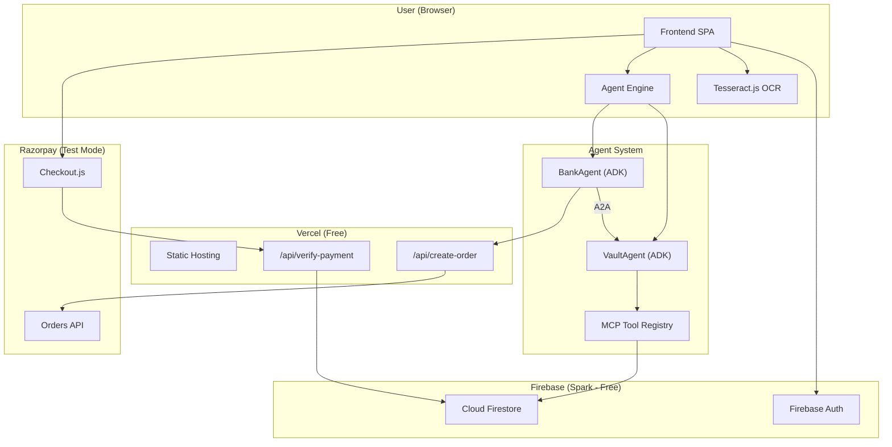
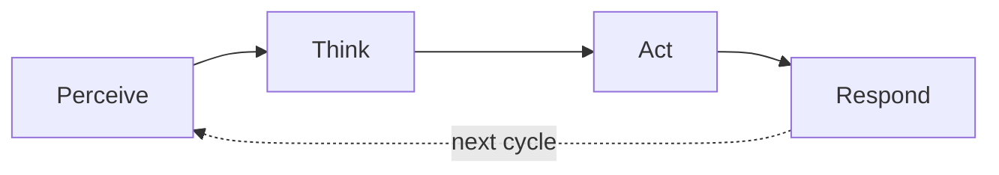
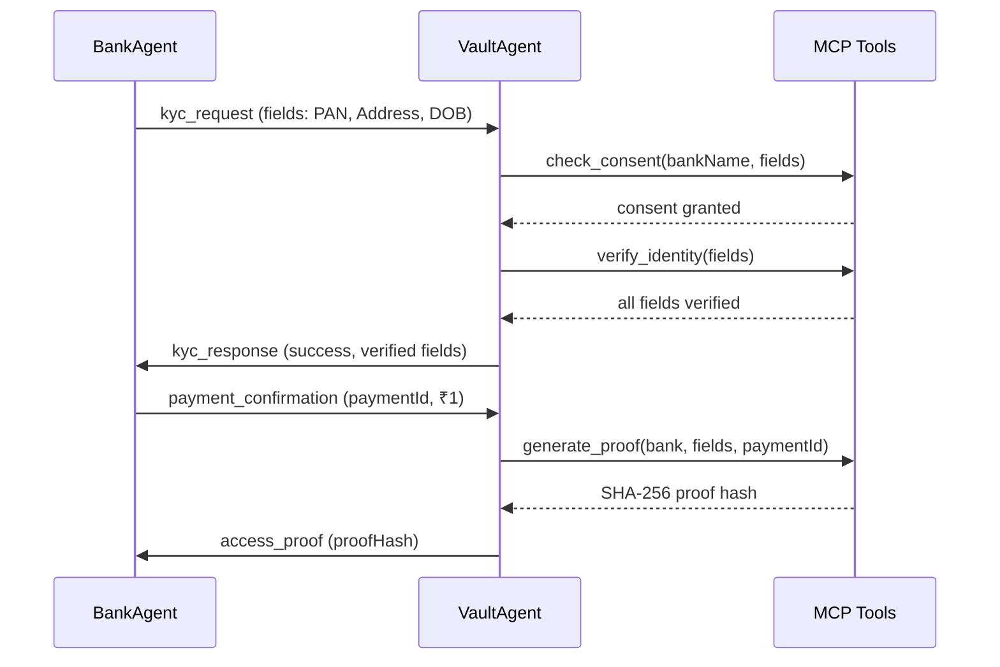
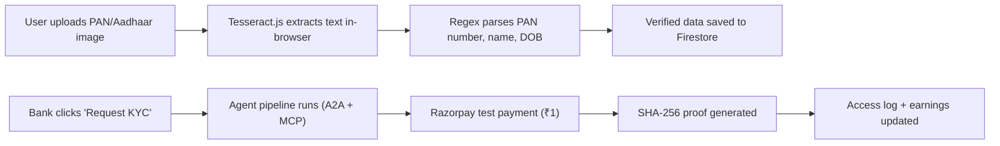

# ClearKYC

**Autonomous KYC using AI Agents & Consent-Based Data Vaults**

> Verify once. Reuse everywhere. With consent. With reward.

**Live Demo:** [https://clearkyc.vercel.app](https://clearkyc.vercel.app)

---

## Team

| Roll Number | Name |
|---|---|
| MITU22BTCS0793 | Shreyash Yashwant Parve |
| MITU22BTCS0713 | Sanchit Santos Aher |
| MITU22BTCS0234 | Chirag Sharma |
| MITU22BTCS0536 | Piyush Malik |

**Guide:** Prof. Rupesh Hushangabad

**Project Code:** LYCC114

---

## Problem Statement

Current KYC systems are broken:

- Users upload the **same documents repeatedly** to every bank
- Banks rely on **manual or semi-manual verification** costing ₹50–150 per customer
- Onboarding takes **days instead of seconds**
- Sensitive documents are **copied and stored everywhere**, creating privacy risks
- A bank performing 10 lakh KYCs/year spends **₹5–15 crore annually**

**Core Problem:** KYC is expensive, repetitive, slow, and unsafe.

---

## Solution

ClearKYC replaces document-based KYC with a **consent-based, AI-agent-driven verification system**.

```
User uploads KYC once → AI verifies & stores in encrypted vault
                        → Bank requests access via agents
                        → User gives consent
                        → Bank gets verified data (not raw documents)
                        → User earns ₹1
```

**Key Idea:** The user owns their data. Banks pay ₹1 per KYC instead of ₹100+. Nobody sees raw documents.

---

## Architecture



---

## Core Protocols

ClearKYC implements four interconnected protocols that work together to enable autonomous, secure KYC verification:

### MCP — Model Context Protocol

Provides **secure, tool-based access** to the user's KYC vault. Instead of giving banks direct database access, MCP exposes a controlled set of tools that agents can invoke.

| Tool | Description |
|---|---|
| `read_document` | Read verified document data from user vault |
| `verify_identity` | Cross-check identity fields across multiple documents |
| `check_consent` | Verify user has granted consent for a specific bank |
| `generate_proof` | Create SHA-256 cryptographic proof of data access |

### ADK — Agent Development Kit

Each agent follows an autonomous **reasoning loop**:



- **VaultAgent** — owns user's KYC data, processes incoming bank requests, invokes MCP tools
- **BankAgent** — represents a bank, creates KYC requests, evaluates responses, triggers payment

### A2A — Agent-to-Agent Communication

Structured message passing between agents with typed messages and unique IDs:



### AP2 — Automated Payment Protocol

Handles the ₹1 payment from bank to user with cryptographic proof:

1. BankAgent triggers Razorpay order creation via `/api/create-order`
2. User completes payment through Razorpay Checkout (test mode)
3. Payment signature verified server-side via `/api/verify-payment`
4. VaultAgent generates SHA-256 proof: `hash(bankName | fields | paymentId | timestamp)`
5. Proof logged to Firestore audit trail and sent to BankAgent via A2A

---

## Data Flow



---

## Firestore Data Model

```
users/
  {uid}/
    displayName, email, photoURL, kycCompletion, totalEarnings, createdAt
    documents/
      pan/     → { fields: {number, name, dob}, verified, verifiedAt }
      aadhaar/ → { fields: {number, name, dob, gender, address}, verified, verifiedAt }
      selfie/  → { fields: {livenessCheck}, verified, verifiedAt }
    accessLogs/
      {logId}/ → { bankName, purpose, fieldsShared, paymentId, amountEarned, timestamp }
```

---

## Tech Stack

| Layer | Technology | Purpose |
|---|---|---|
| Frontend | HTML/CSS/JS (vanilla) | Single-page application |
| Authentication | Firebase Auth | Google Sign-In |
| Database | Cloud Firestore | User vaults, documents, access logs |
| OCR | Tesseract.js | On-device document text extraction |
| Agent System | Custom JS (agents.js) | MCP, ADK, A2A, AP2 protocols |
| Payments | Razorpay (test mode) | ₹1 bank-to-user payments |
| Backend APIs | Vercel Serverless | Order creation, payment verification |
| Hosting | Vercel | Static + serverless deployment |

---

## Project Structure

```
ClearKYC/
├── public/                     Frontend (served by Vercel)
│   ├── index.html              Main SPA with all screens
│   ├── css/
│   │   └── styles.css          Complete stylesheet
│   └── js/
│       ├── firebase-config.js  Firebase initialization + exports
│       ├── auth.js             Google Sign-In flow
│       ├── vault.js            Document upload + Tesseract OCR + Firestore
│       ├── agents.js           Agent system (MCP, ADK, A2A, AP2)
│       ├── payment.js          Razorpay integration + access logs
│       └── app.js              Main controller, routing, UI rendering
├── api/                        Vercel serverless functions
│   ├── create-order.js         Creates Razorpay test order
│   ├── verify-payment.js       Verifies Razorpay payment signature
│   └── verify-document.js      (Legacy — OCR now runs client-side)
├── vercel.json                 Vercel routing config
├── package.json                Dependencies
├── SETUP.md                    Setup guide
└── README.md                   This file
```

---

## Security & Privacy

| Feature | Implementation |
|---|---|
| Data ownership | All KYC data stored under user's own Firestore path |
| No raw document storage | Images processed in-browser via Tesseract, only text saved |
| Consent-based access | MCP `check_consent` tool verifies permission before sharing |
| Cryptographic proof | SHA-256 hash of every access for audit trail |
| Secret protection | Razorpay secret key stored in Vercel env vars, never exposed |
| Auth security | Firebase Auth handles tokens, session management |
| Firestore rules | Users can only read/write their own documents |

---

## Demo Script

Follow these steps to demonstrate ClearKYC to your professor. The entire flow takes approximately 3–5 minutes.

### Prerequisites

- Open [https://clearkyc.vercel.app](https://clearkyc.vercel.app) in Chrome
- Have a PAN card image and an Aadhaar card image ready on your device
- Have any selfie photo ready
- **Test card for payment:** `4111 1111 1111 1111`, expiry: any future date, CVV: any 3 digits

### Step 1 — Sign In (30 seconds)

1. Click **"Sign in with Google"**
2. Select your Google account
3. You land on the **Dashboard** — all three documents show "PENDING"

> **What to explain:** "The user signs in once. Their encrypted KYC vault is created automatically in Firebase."

### Step 2 — Upload PAN Card (30–45 seconds)

1. Click **"Complete Verification"** or go to **KYC Vault** tab
2. Click the **PAN Card** upload area
3. Select a PAN card image
4. Watch the **AI Verification Process** screen:
   - File format check (instant)
   - **OCR extraction** with progress bar (Tesseract running in-browser)
   - Details verification (regex validates PAN format `ABCDE1234F`)
   - Fraud detection check
   - Saved to vault

> **What to explain:** "The image is processed entirely in the user's browser using Tesseract OCR. The raw image never leaves the device — only the extracted PAN number, name, and DOB are stored in the encrypted vault. This is a key privacy feature."

### Step 3 — Upload Aadhaar + Selfie (1 minute)

1. Go to **Documents** in the vault sidebar
2. Upload an Aadhaar card image — same verification flow
3. Upload any selfie — liveness check runs
4. Go back to **Dashboard** — all three should show **VERIFIED**, progress bar at 100%

> **What to explain:** "The user verifies once. This vault can now be reused by any bank, any number of times, without re-uploading documents."

### Step 4 — Bank View + Agent Pipeline (1–2 minutes)

This is the most impressive part of the demo.

1. Go to **Bank View** tab
2. Notice the **agent status dots** (VaultAgent, BankAgent, MCP Tools, AP2 Payment)
3. See the **verified fields** the bank would receive (PAN, Address, DOB, Liveness)
4. Click **"State Bank of India"** card
5. Watch the status dots light up as the agent pipeline runs
6. **Razorpay payment popup** appears — enter test card:
   - Card: `4111 1111 1111 1111`
   - Expiry: `12/30` (any future date)
   - CVV: `123` (any 3 digits)
7. Payment succeeds — toast shows "KYC approved via A2A!"

> **What to explain:** "When SBI requests KYC, the BankAgent sends a request to the VaultAgent via A2A protocol. The VaultAgent checks consent, reads the vault using MCP tools, and responds with only the verified fields — never raw documents. The bank pays ₹1 via Razorpay, and a SHA-256 cryptographic proof is generated for the audit trail."

### Step 5 — Agent Log (30 seconds)

1. Go to **Agent Log** tab
2. Show the color-coded live log:
   - **Yellow (ADK):** Agent reasoning steps — perceive, think, act, respond
   - **Blue (A2A):** Messages between VaultAgent and BankAgent
   - **Purple (MCP):** Tool calls — `check_consent`, `verify_identity`, `generate_proof`
   - **Green (AP2):** Payment confirmation and SHA-256 proof hash

> **What to explain:** "This is the full audit trail. Every agent decision, every tool call, every message between agents is logged. A regulator can verify exactly what was shared, when, and with cryptographic proof."

### Step 6 — Access Log + Earnings (30 seconds)

1. Go to **Access Log** tab
2. Show the earnings card (₹1.00 earned)
3. Show the log entry with bank name, purpose, fields shared, and timestamp
4. Try clicking another bank (HDFC or ICICI) to show multiple entries accumulating

> **What to explain:** "The user earns ₹1 for every KYC usage. All access is tracked in real-time. The user has full visibility and control over who accessed their data."

### Step 7 — How It Works (15 seconds)

1. Go to **How It Works** tab
2. Show the flow diagram: User → Vault → AI Agent → Bank → Payment
3. Point out the **4 core protocols** (MCP, ADK, A2A, AP2)
4. Point out the **infrastructure** (Firebase, Tesseract, Razorpay, Vercel)

---

## Economic Model

| Metric | Traditional KYC | ClearKYC |
|---|---|---|
| Cost per KYC | ₹50–150 | ₹1 |
| Time to verify | 1–3 days | < 30 seconds |
| Documents stored by bank | Full copies | None (verified fields only) |
| User data control | None | Full consent-based control |
| User earnings | ₹0 | ₹1 per access |
| Repeat KYC needed | Yes, every bank | No, verify once |

For a bank doing 10 lakh KYCs/year: **₹5–15 crore** becomes **₹10 lakh** — a **95%+ cost reduction**.

---

## Future Scope

- **Loans & credit verification** — extend vault to include credit score, income proof
- **Insurance onboarding** — same consent-based model for insurance KYC
- **Employment verification** — employers verify candidate identity via agents
- **Cross-bank portability** — verified KYC transfers between banks automatically
- **Cross-country KYC** — international identity verification for NRIs
- **Regulatory dashboard** — dedicated view for regulators to audit consent and proof chains

---

## Local Development

```bash
# Clone the repo
git clone https://github.com/malikdotexe/ClearKYC.git
cd ClearKYC

# Install dependencies
npm install

# Create .env.local with your keys
echo "RAZORPAY_KEY_ID=rzp_test_xxx" >> .env.local
echo "RAZORPAY_KEY_SECRET=xxx" >> .env.local

# Run locally
npx vercel dev
```

---

## Deployment

The app is deployed on Vercel and auto-deploys on every push to `main`.

```bash
vercel --prod
```

**Live URL:** [https://clearkyc.vercel.app](https://clearkyc.vercel.app)

---

## License

Built for MIT-WPU Mini Project (2025–26). All rights reserved.
